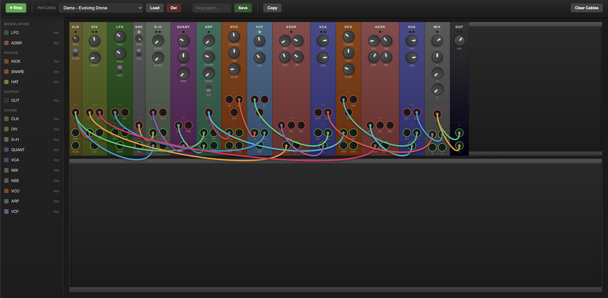

# eurorack-js

Browser-based Eurorack modular synthesizer emulator. Patch virtual modules together with cables to create sounds.

**[Try it live](https://orderandch4os.github.io/eurorack-js/)**



## Modules

### Sources
| Module | Description |
|--------|-------------|
| CLK | Master clock with adjustable BPM |
| VCO | Voltage-controlled oscillator (triangle, saw, pulse) |
| LFO | Low frequency oscillator with multiple waveforms |
| NSE | White/pink noise generator |

### Modulators
| Module | Description |
|--------|-------------|
| DIV | Clock divider (÷2 to ÷32) |
| S+H | Dual sample & hold |
| QUANT | Pitch quantizer with selectable scales |
| ARP | Arpeggiator with chord patterns |
| SEQ | 8-step CV/gate sequencer with direction modes |
| EUCLID | Euclidean rhythm generator (evenly distributed triggers) |
| ADSR | Envelope generator |

### Processors
| Module | Description |
|--------|-------------|
| VCF | State-variable filter (LP, BP, HP) |
| VCA | Dual voltage-controlled amplifier |
| MIX | 4-channel mixer with level controls |
| DLY | Stereo delay with time, feedback, mix |
| VERB | Stereo reverb with size, damping, mix |

### Drums
| Module | Description |
|--------|-------------|
| KICK | Analog-style kick drum synthesizer |
| SNARE | Analog-style snare drum synthesizer |
| HAT | Analog-style hi-hat synthesizer |

### Utility
| Module | Description |
|--------|-------------|
| ATTN | Dual attenuverter with offset (scale, invert, shift CV) |
| SLEW | Dual slew limiter (portamento, CV smoothing) |
| SCOPE | Dual-channel oscilloscope (Scope, X-Y, Tune modes) |
| OUT | Stereo output to speakers |

## Architecture

Self-contained module system where each module is a folder containing DSP + UI:

```
src/js/
├── index.js              # Main entry point
├── audio/
│   └── engine.js         # DSP processing loop
├── cables/
│   └── cable-manager.js  # Cable rendering & connections
├── config/
│   ├── constants.js      # System constants
│   └── factory-patches.js
├── modules/              # Module definitions
│   └── {moduleId}/
│       └── index.js      # DSP + UI
├── patches/              # Patch serialization
├── rack/                 # Rack infrastructure
│   ├── rack.js           # Orchestration
│   └── registry.js       # Module lookup
├── ui/
│   ├── renderer.js       # Module UI generation
│   └── toolkit/          # UI components
└── utils/                # Utility functions
    ├── math.js
    ├── slew.js
    └── color.js
```

## Creating a Module

See the **[Module Creation Guide](docs/creating-modules.md)** for detailed documentation.

Quick example:

```javascript
// src/js/modules/mymodule/index.js
export default {
    id: 'mymodule',
    name: 'My Module',
    hp: 4,
    color: '#8b4513',
    category: 'utility',

    createDSP({ sampleRate = 44100, bufferSize = 512 } = {}) {
        const out = new Float32Array(bufferSize);
        return {
            params: { gain: 0.5 },
            inputs: { audio: new Float32Array(bufferSize) },
            outputs: { out },
            leds: {},
            process() {
                for (let i = 0; i < bufferSize; i++) {
                    out[i] = this.inputs.audio[i] * this.params.gain;
                }
            }
        };
    },

    ui: {
        knobs: [{ id: 'gain', label: 'Gain', param: 'gain', min: 0, max: 1, default: 0.5 }],
        inputs: [{ id: 'audio', label: 'In', port: 'audio', type: 'audio' }],
        outputs: [{ id: 'out', label: 'Out', port: 'out', type: 'audio' }]
    }
};
```

## Voltage Standards

- **Audio**: ±5V bipolar
- **Gates**: 0V (off) / 10V (on)
- **Triggers**: 5-10ms pulse at 5-10V
- **Pitch CV**: 1V/octave

## Development

```bash
npm test         # Run tests
```

## License

MIT
