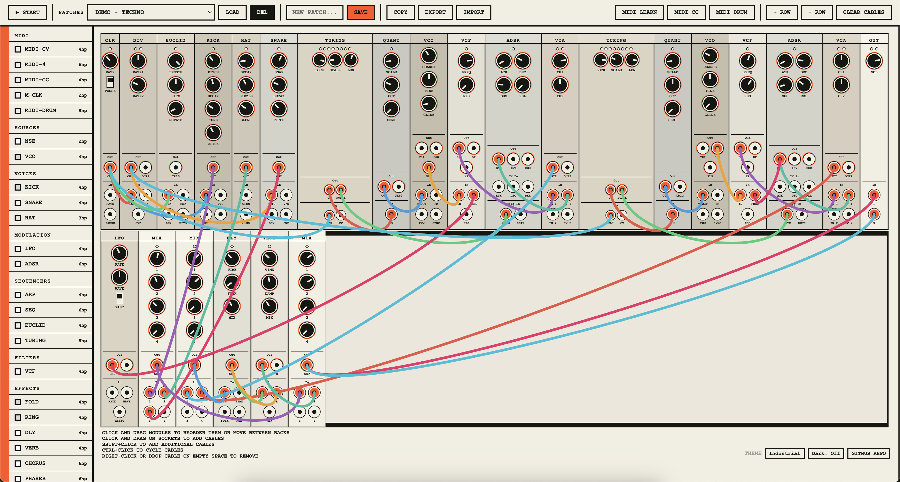

# eurorack-js

Browser-based Eurorack modular synthesizer emulator. Patch virtual modules together with cables to create sounds.

**[Try it live](https://orderandch4os.github.io/eurorack-js/)**



## Modules

Built-in modules are loaded in the order listed by `src/js/rack/module-manifest.js` and grouped by each module definition's sidebar category.

### MIDI
| ID | Module | Description |
|----|--------|-------------|
| `midi-cv` | MIDI-CV | Mono MIDI-to-CV interface with pitch, gate, velocity, and mod outputs |
| `midi-4` | MIDI-4 | Four-voice polyphonic MIDI-to-CV interface |
| `midi-cc` | MIDI-CC | Four assignable MIDI CC to CV outputs |
| `midi-clk` | M-CLK | MIDI clock, reset, and run outputs |
| `midi-drum` | MIDI-DRUM | MIDI drum pads to trigger outputs plus velocity CV |

### Clock
| ID | Module | Description |
|----|--------|-------------|
| `clk` | CLK | Master clock with adjustable rate, pause control, and rate CV |
| `div` | DIV | Dual clock divider/multiplier with CV rate control |

### Sources
| ID | Module | Description |
|----|--------|-------------|
| `nse` | NSE | White and pink noise generator |
| `vco` | VCO | Voltage-controlled oscillator with triangle, saw, and pulse outputs |

### Voices
| ID | Module | Description |
|----|--------|-------------|
| `kick` | KICK | Analog-style kick drum synthesizer |
| `snare` | SNARE | Analog-style snare drum synthesizer |
| `hat` | HAT | Hi-hat synthesizer with separate open and closed triggers |

### Modulation
| ID | Module | Description |
|----|--------|-------------|
| `lfo` | LFO | Low frequency oscillator with multiple waveforms |
| `rnd` | RND | Random voltage generator with stepped, smooth, and gate outputs |
| `func` | FUNC | Function generator for envelopes, cycling LFOs, and slew behavior |
| `adsr` | ADSR | ADSR envelope generator with CV timing inputs |
| `ochd` | OCHD | Eight free-running triangle LFOs based on Instruo ochd |

### Sequencers
| ID | Module | Description |
|----|--------|-------------|
| `arp` | ARP | Triggered chord arpeggiator with root and chord CV |
| `seq` | SEQ | 8-step CV/gate sequencer with direction and range controls |
| `euclid` | EUCLID | Euclidean rhythm generator with length, hits, and rotation controls |
| `turing` | TURING | Random looping sequencer based on Music Thing Turing Machine |

### Quantizers
| ID | Module | Description |
|----|--------|-------------|
| `quant` | QUANT | Pitch quantizer with selectable scales and trigger output |

### Filters
| ID | Module | Description |
|----|--------|-------------|
| `vcf` | VCF | State-variable filter with low-pass, band-pass, and high-pass outputs |

### Effects
| ID | Module | Description |
|----|--------|-------------|
| `fold` | FOLD | Wavefolder for adding harmonic complexity |
| `ring` | RING | Ring modulator for signal multiplication |
| `dly` | DLY | Mono digital delay with time, feedback, mix, and CV control |
| `verb` | VERB | Stereo reverb with time, damping, mix, and mix CV |
| `chorus` | CHORUS | Stereo chorus effect |
| `phaser` | PHASER | Stereo phaser effect |
| `flanger` | FLANGER | Stereo flanger effect |
| `crush` | CRUSH | Bit crusher and sample-rate reducer |
| `loop` | LOOP | Minimal looper with record, reverse, half-speed, and clear controls |
| `granulita` | GRANULITA | Stereo granular chord processor based on Noise Engineering Granulita Versio |

### Utility
| ID | Module | Description |
|----|--------|-------------|
| `sh` | S+H | Dual sample and hold |
| `logic` | LOGIC | Boolean gate operator with AND and OR outputs |
| `mult` | MULT | Two-input, six-output signal splitter |
| `matrix` | MATRIX | 4x4 DC-coupled matrix mixer with unipolar and bipolar output modes |
| `envf` | ENVF | Envelope follower with normal and inverted CV outputs |
| `vca` | VCA | Dual voltage-controlled amplifier |
| `atten` | ATTN | Dual attenuverter with offset controls |
| `slew` | SLEW | Dual slew limiter for portamento and CV smoothing |
| `db` | DB | Stereo VU/peak meter with audio passthrough |
| `pwm` | PWM | Pulse-width modulator with complementary outputs |
| `cmp2` | CMP2 | Dual window comparator with logic outputs based on Joranalogue Compare 2 |
| `mix` | MIX | Four-channel mixer with level controls |
| `scope` | SCOPE | Dual-channel oscilloscope with scope, X-Y, and tuning modes |
| `spectrum` | SPECTRUM | Real-time FFT spectrum analyzer with audio passthrough |
| `plot` | PLOT | Waveform plotter and signal monitor with trigger input |
| `spectrogram` | SPECTRO | Scrolling spectrogram analyzer with audio passthrough |
| `rec` | REC | WAV recorder with stereo passthrough |

### Output
| ID | Module | Description |
|----|--------|-------------|
| `out` | OUT | Stereo output to speakers |

## Architecture

Self-contained module system where each module is a folder containing DSP + UI. The browser app is a thin HTML shell backed by a state-driven app layer:

```
src/js/
├── index.js              # Public exports
├── app/                  # Browser app state/controllers
│   ├── app.js            # App bootstrap and event orchestration
│   ├── rack-state.js     # Modules, rows, params, cables, patch state
│   └── patch-format.js   # v2 patch normalization/migration
├── audio/
│   └── engine.js         # DSP processing loop
├── cables/
│   └── cable-manager.js  # Cable rendering & connections
├── config/
│   ├── constants.js      # System constants
│   ├── factory-patches.js # Aggregate factory patch export
│   └── patches/           # Factory patch definitions
├── modules/              # Module definitions
│   └── {moduleId}/
│       └── index.js      # DSP + UI
├── patches/              # Patch serialization
├── rack/                 # Rack infrastructure
│   ├── module-manifest.js # Module order, category taxonomy, dynamic imports
│   ├── rack.js           # Legacy/simple rack helper
│   └── registry.js       # Module lookup/validation
├── ui/
│   ├── renderer.js       # Module UI generation
│   └── toolkit/          # UI components
└── utils/                # Utility functions
    ├── math.js
    ├── slew.js
    └── color.js
```

## Creating a Module

See the **[Module Creation Guide](docs/creating-modules.md)** for detailed documentation.

Quick example:

```javascript
// src/js/modules/mymodule/index.js
export default {
    id: 'mymodule',
    name: 'My Module',
    hp: 4,
    color: 'module-color-six',
    category: 'utility',

    createDSP({ sampleRate = 44100, bufferSize = 512 } = {}) {
        const out = new Float32Array(bufferSize);
        return {
            params: { gain: 0.5 },
            inputs: { audio: new Float32Array(bufferSize) },
            outputs: { out },
            leds: {},
            process() {
                for (let i = 0; i < bufferSize; i++) {
                    out[i] = this.inputs.audio[i] * this.params.gain;
                }
            }
        };
    },

    ui: {
        knobs: [{ id: 'gain', label: 'Gain', param: 'gain', min: 0, max: 1, default: 0.5 }],
        inputs: [{ id: 'audio', label: 'In', port: 'audio', type: 'audio' }],
        outputs: [{ id: 'out', label: 'Out', port: 'out', type: 'audio' }]
    }
};
```

Register new modules in `src/js/rack/module-manifest.js`; the registry and default processing order are derived from that manifest, while sidebar grouping comes from the module's `category`.

## Patch Format

Patch state is canonicalized to version 2:

```javascript
{
    version: 2,
    modules: [{ id: 'vco_1', type: 'vco', row: 1, index: 0 }],
    params: { vco_1: { coarse: 0.35 } },
    cables: [{ fromModule: 'vco_1', fromPort: 'triangle', toModule: 'out_1', toPort: 'L' }],
    midiMappings: {}
}
```

Older factory/user patches with `knobs`, `switches`, `buttons`, and `instanceId` are normalized through `src/js/app/patch-format.js`.

## Voltage Standards

- **Audio**: ±5V bipolar
- **Gates**: 0V (off) / 10V (on)
- **Triggers**: 5-10ms pulse at 5-10V
- **Pitch CV**: 1V/octave

## Development

```bash
npm test         # Run tests
```

## License

MIT
